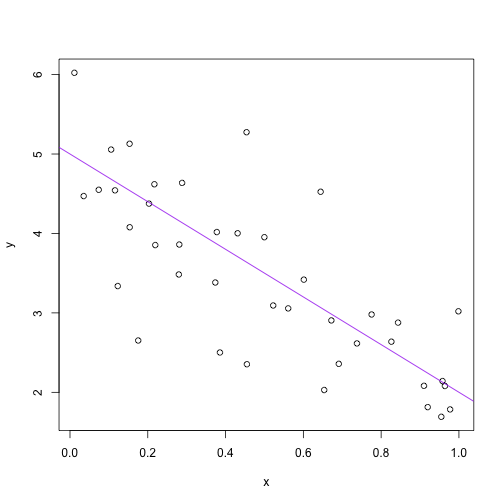

```r
a <- 5
b <- -3
sigSq <- 0.5
n <- 40
x <- runif(n)
y <- a + b * x + rnorm(n, sd = sqrt(sigSq))
(avgX <- mean(x))
```

```
## [1] 0.4906
```

```r
write(avgX, "avgX.txt")
plot(x, y)
abline(a, b, col = "purple")
```

 

```r
dev.print(pdf, "toyLinePlot.pdf")
```

```
## pdf 
##   2
```


